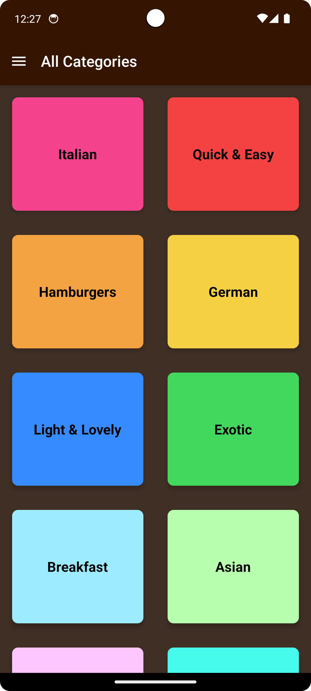
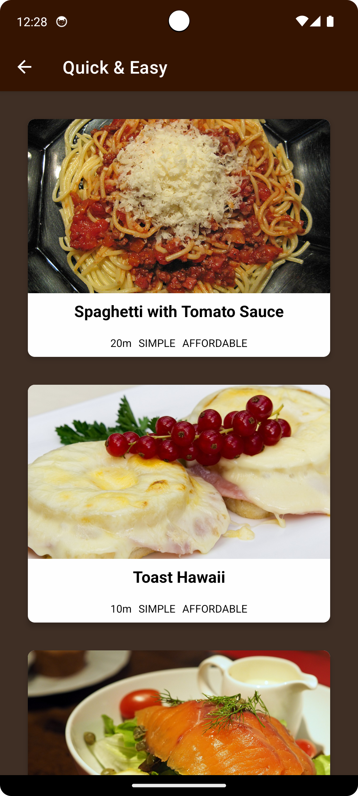
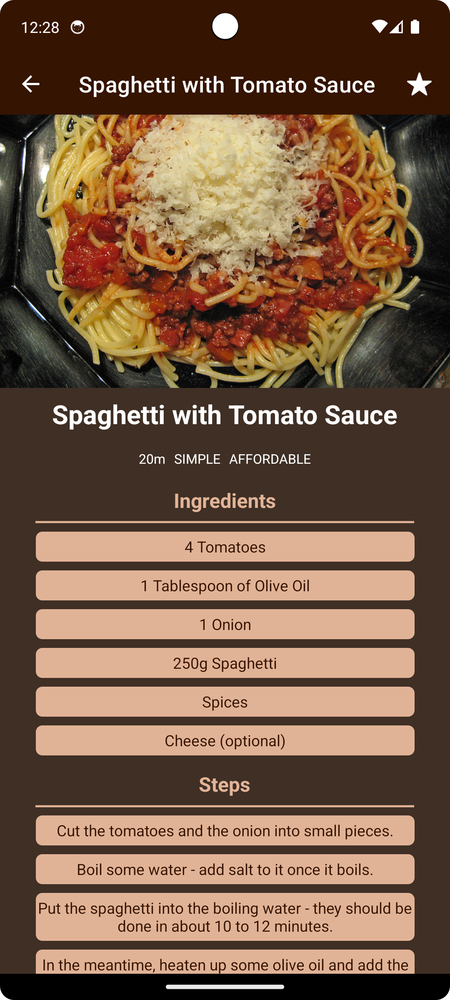
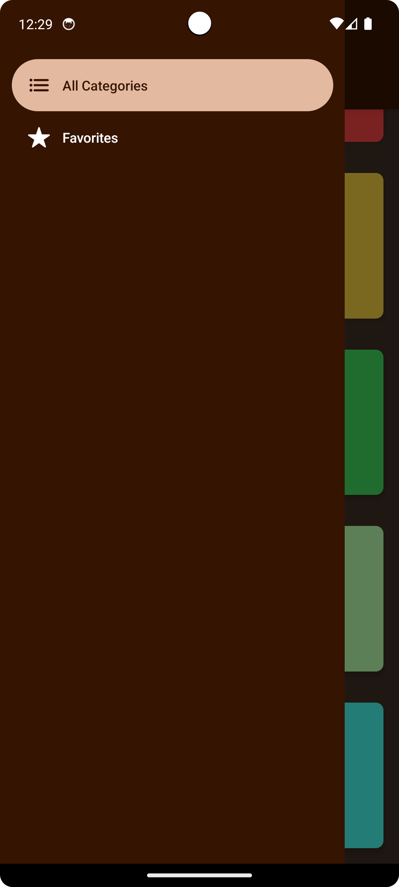
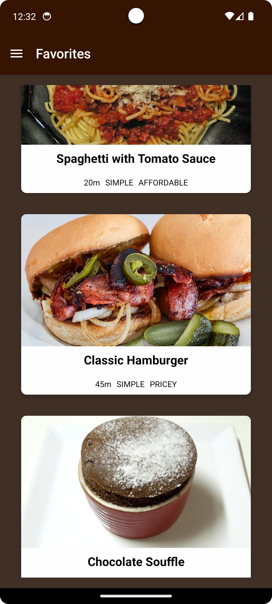

# MealsApp 🍕

[](LICENSE)
[](https://reactnative.dev/)

Aplicativo de receitas com navegação completa que organiza pratos por categorias usando dados locais.

<p align="center">
  
    
  
</p>
<p align="center">
  
  
</p>

## ✨ Funcionalidades

- **Sistemas de navegação**:
  - Stack Navigation (fluxo principal)
  - Drawer Navigation (menu lateral)
  - Native Stack (transições otimizadas)
  
- **Categorias de receitas**:
  - Exóticas
  - Baratas
  - Rápidas
  - Etc.

- **Detalhes completos**:
  - Lista de ingredientes
  - Modo de preparo
  - Botão de favoritar

- **Gerenciamento de estado**:
  - Context API para favoritos
  - Dados locais em JSON (sem API externa)

## 🛠 Tecnologias Utilizadas

- React Native
- React Navigation
  - @react-navigation/native
  - @react-navigation/native-stack
  - @react-navigation/drawer
- Context API
- Dummy data (fornecido pelo curso)

## 🧠 O Que Aprendi
- Configuração de múltiplos tipos de navegação
- Aninhamento de navigators (Stack dentro de Drawer)
- Uso do Native Stack para performance
- Gerenciamento de estado com Context API
- Passagem de parâmetros entre rotas

## 🚀 Como Executar

1. Clone o repositório:
```bash
git clone https://github.com/pedester321/RNmealsApp
cd mealsApp
```

2. Instale as dependências:

```bash
npm install
```

3. Inicie o aplicativo:

```bash
npm start
```

Ou, se estiver usando Expo:

```bash
expo start
```

4. Escaneie o QR Code com o aplicativo Expo Go no celular ou use um emulador.

## 📝 Licença

Este projeto está licenciado sob a licença MIT.

---

Desenvolvido por Pedro Castro como parte do curso **React Native - The Practical Guide** na Udemy.
